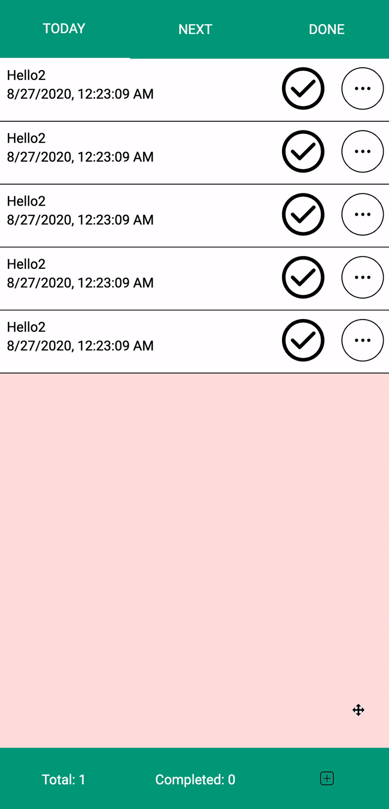
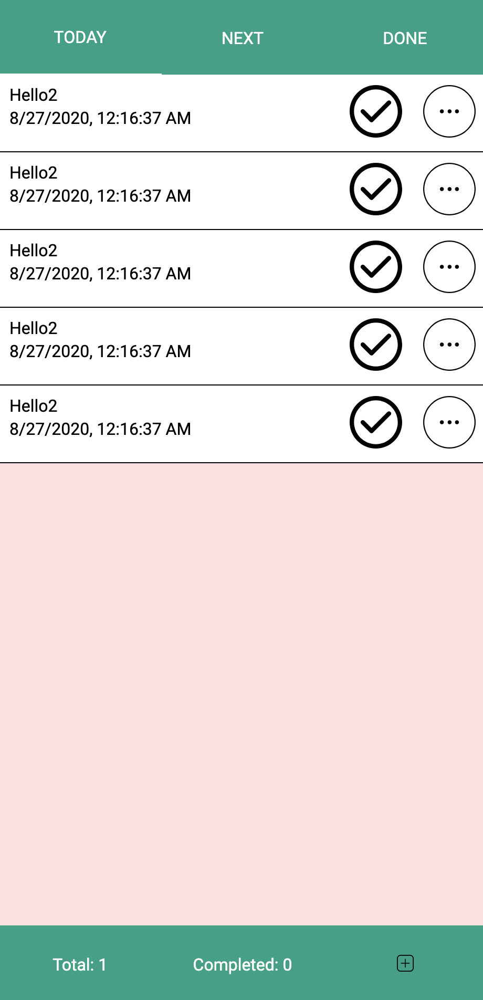
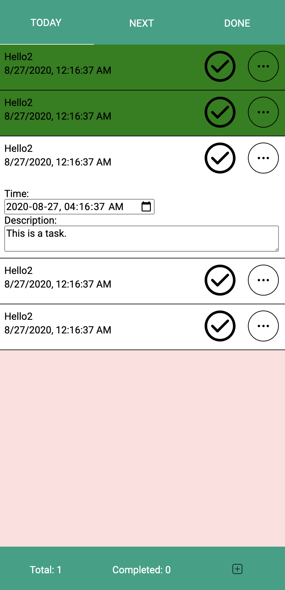
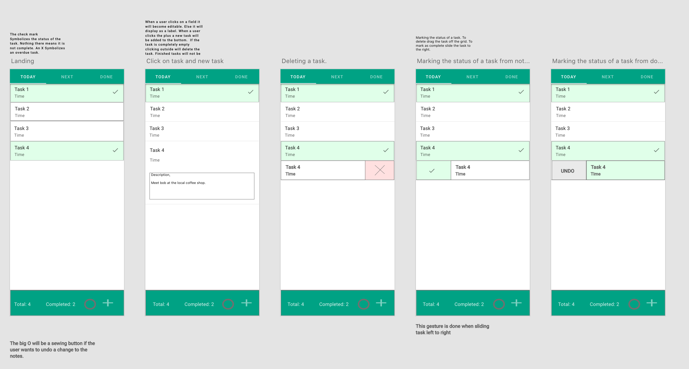

# NOTES APP

Note app is a productivity tool to help you keep track of your day. Record tasks for a day and mark them complete when you are finished by dragging by simply dragging the task.

  Visit: <a href="https://notes-app-74f70.web.app/">www.notesapp.ca</a>
  
  **Languages**: Typescript, React, MaterialUI

  

  
  

## Screenshots

  

   
  

  

   
  

## Designs

  - Adobe XD wireframes

  

  
  

## Tech stack

 - React, Typescript
 - HTML, CSS, Material-UI
 - AdobeXD

## Contributors
  :bowtie: Steven Stapleton
